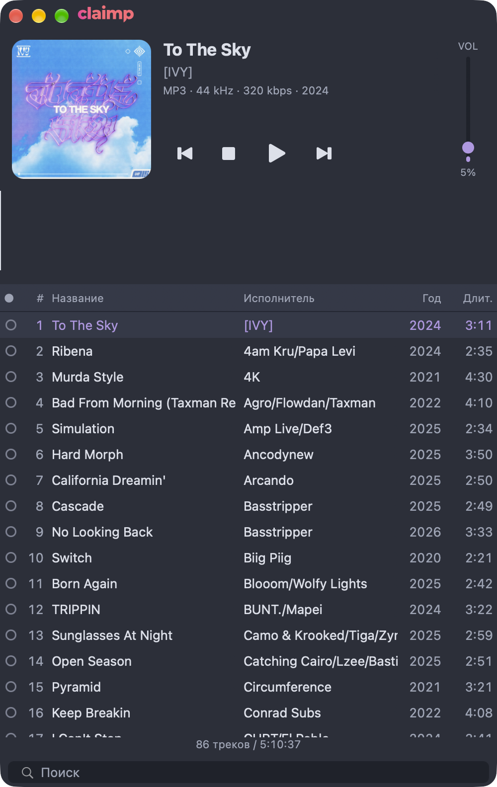

# Claimp

**A native macOS player for DJ mix preparation.** Open a folder of tracks, see the
whole track as a spectral waveform, listen through, mark what you want with a lamp,
and drag the real file out into your DAW.

Early, personal tool (v0.1.0) — built for one DJ workflow, published because it might
be useful to someone else. No support promises, UI and file layout still move.



## What it does

- **Spectral waveform of the whole track** — not a scrolling preview. Loudness is the
  column height (RMS with soft compression), colour is the frequency balance
  (Serato-style spectrum: red lows through yellow/green to violet highs). Click or
  drag along it to seek.
- **Drag the file out** — from a playlist row or from the cover art: the real audio
  file lands in Ableton Live, Bitwig, Finder, Telegram or anywhere else that accepts a
  file drop. The waveform only seeks.
- **Playlist with the columns a mix prep needs** — lamp, number, title, artist,
  **release year**, **duration**. Click a header to sort, type two letters to filter.
- **Played lamp that survives restarts** — stored in SQLite next to the app's
  Application Support data, keyed by file path; playlist order and the current track
  are restored too.
- **Folder drop** — drop a folder on the window or the Dock icon and it becomes the
  playlist.
- **Media keys and Now Playing** — F8/F9/F10 work when the window is not focused and
  the system Now Playing panel shows the track.
- Formats: whatever SFBAudioEngine decodes — MP3, FLAC, WAV, AIFF, M4A and more.
- No Xcode project, no Electron, no network access: SwiftPM builds the app bundle
  with a script.

## Install

Download `Claimp-<version>.dmg` from the
[Releases page](https://github.com/smixs/claimp/releases), open it and drag **Claimp**
into **Applications**. The app is signed with a Developer ID certificate and notarized
by Apple, so it opens without a Gatekeeper warning.

Prefer the zip? `Claimp-<version>.zip` on the same page holds the same notarized
bundle.

## Requirements

- macOS 26 or newer (`Package.swift`: `.macOS(.v26)`)
- Swift 6.3 toolchain (Xcode 26.x or the matching Command Line Tools), Swift 6
  language mode
- Build verified on Apple Silicon with Swift 6.3.3

## Build and run

```bash
make build     # debug build (swift build)
make test      # tests (swift-testing)
make app       # release build + build/Claimp.app with Info.plist, ad-hoc signed
make run       # build the .app and launch it
make clean     # remove .build and build/
```

Distribution (needs the project's Developer ID certificate and a notarization profile
in the Keychain, so this is for the maintainer):

```bash
make dist      # Developer ID + hardened runtime -> build/Claimp.app, zip, styled DMG
make notarize  # notarize the app, staple it, rebuild + notarize + staple the DMG
make verify    # codesign / stapler / spctl checks on the result
make release   # dist -> notarize -> verify
```

The same steps without `make`:

```bash
swift build
swift test
scripts/build-app.sh release   # prints the bundle path it wrote
scripts/run.sh                 # build and open
```

`build-app.sh`
always prints the path it wrote.

## Architecture

Four SwiftPM targets, one direction of dependencies (`App` → `Playback`/`Waveform` →
`Core`):

| Module | Responsibility |
|---|---|
| `Sources/Core` | Track model, library scanner (SFBAudioEngine + TagLib metadata), played flags and playlist order in SQLite (GRDB), filter/sort/navigation logic |
| `Sources/Playback` | `PlayerEngine` (SFBAudioEngine playback, seek, gapless queue) and `NowPlayingBridge` (media keys, Now Playing) |
| `Sources/Waveform` | `PCMReader` → `BandSplitter` → `WaveformAnalyzer` → `WaveformCache` → `WaveformView`/`WaveformResampler`; every visual and analysis constant lives in `WaveformStyle` |
| `Sources/App` | AppKit window, header (cover, transport, vertical volume fader), playlist table, waveform view, drag-out/drop; every colour and size token lives in `Theme.swift` |

Documents: `SPEC.md` is the behaviour contract (sections 4–8 are the UI, data and
acceptance contracts), `PLAN.md` is the work plan, `research/` holds the source-based
survey of the components the player is assembled from, `AGENTS.md` is the engineering
runbook (test-first, per-task worktrees, gate checks). These documents are written in
Russian; the code and this README are in English.

## Third-party code and licenses

Claimp is assembled from open-source components. Full attribution, per-component
usage notes and license texts (where required) are in **[NOTICE](NOTICE)**:

| Component | Used for | License |
|---|---|---|
| [Aural Player](https://github.com/kartik-venugopal/aural-player) | waveform module, folder drop | MIT |
| [Bòcan](https://github.com/bocan/bocan-music) | playlist table, file drag-out, media keys | Apache-2.0 |
| [SFBAudioEngine](https://github.com/sbooth/SFBAudioEngine) | playback and metadata | MIT |
| TagLib (inside SFBAudioEngine) | tag reading | LGPL 2.1 / MPL 1.1 |
| [GRDB.swift](https://github.com/groue/GRDB.swift) | SQLite storage | MIT |
| [swift-property-based](https://github.com/x-sheep/swift-property-based) | tests only | MIT |
| [WaveformKit](https://github.com/GRimAce11/WaveformKit) | cache key scheme only, no code copied | MIT |
| [Mixxx](https://github.com/mixxxdj/mixxx) | spectral waveform algorithm only, no code copied | GPL-2.0 |

## License

Apache License 2.0 — see [LICENSE](LICENSE). Copyright 2026 Sergey Shima.

---

## По-русски

**Claimp** — нативный macOS-плеер для подготовки DJ-микса. Открываешь папку с треками,
видишь спектральную волну всего трека, слушаешь, отмечаешь лампочкой нужное и
перетаскиваешь настоящий файл прямо в DAW.

- Волна всего трека: высота столбика — громкость (RMS с мягкой компрессией), цвет —
  спектр частот (как у Serato: красный на низах, через жёлтый и зелёный к
  фиолетовому на верхах). Клик и протяжка по волне — перемотка.
- Drag-out файла из двух мест: строка плейлиста и обложка. Файл принимают
  Ableton Live, Bitwig, Finder, Telegram и всё остальное, что умеет drop файлов.
- Плейлист с нужными для микса колонками: лампочка, номер, название, исполнитель,
  **год**, **длительность**; сортировка кликом по заголовку, фильтр по паре букв.
- Лампочка «сыграно» живёт в SQLite и переживает перезапуск; порядок плейлиста и
  текущий трек тоже восстанавливаются.
- Папку можно бросить на окно или на иконку в Dock; медиаклавиши и Now Playing
  работают при неактивном окне.

**Требования:** macOS 26+, Swift 6.3 (Xcode 26.x или соответствующие Command Line
Tools). Сборка проверена на Apple Silicon, Swift 6.3.3.

```bash
make build     # debug-сборка
make test      # тесты
make app       # release + build/Claimp.app (ad-hoc подпись)
make run       # собрать .app и запустить
make release   # дистрибутив: Developer ID, нотаризация, DMG (нужен сертификат)
```

**Установка из релиза:** скачать `Claimp-<версия>.dmg` со [страницы релизов](https://github.com/smixs/claimp/releases),
открыть и перетащить Claimp в Applications. Подписано Developer ID и нотаризовано
Apple — Gatekeeper не ругается.

Архитектура: четыре модуля — `Core` (модель, сканер, SQLite), `Playback`
(воспроизведение, медиаклавиши), `Waveform` (анализ и отрисовка волны), `App`
(AppKit-интерфейс). Документы проекта (`SPEC.md`, `PLAN.md`, `research/`, `AGENTS.md`)
на русском, код и README — на английском.

**Статус:** ранний личный инструмент (v0.1.0), без обещаний поддержки.

**Лицензия:** Apache License 2.0 (`LICENSE`), Copyright 2026 Sergey Shima. Сторонний
код и его лицензии — в `NOTICE`.
