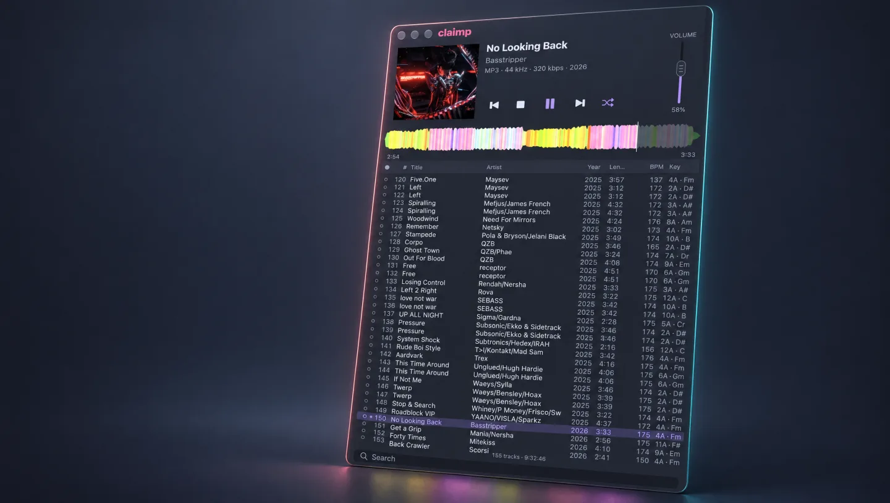
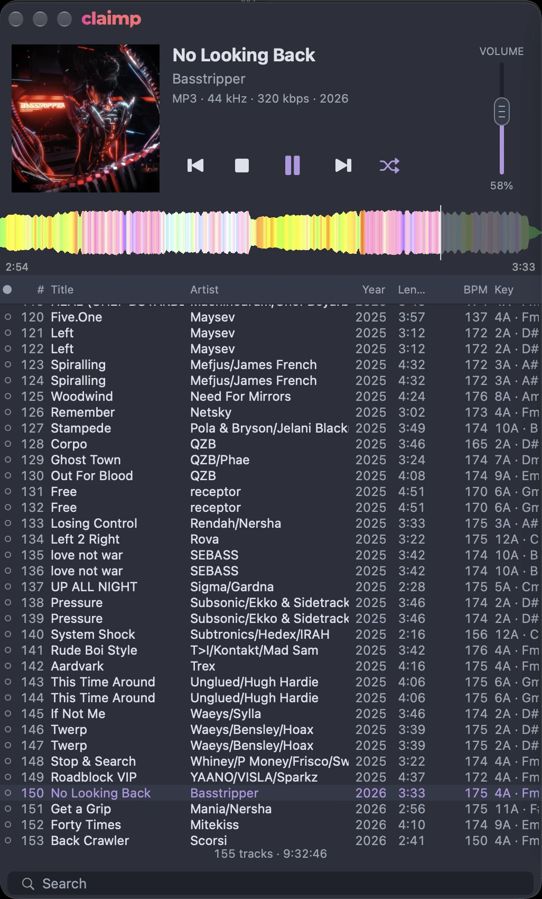

<p align="center">
  
</p>

<p align="center"><b>The waveform player for building DJ sets on macOS.</b><br>
<a href="https://claimp.app">claimp.app</a></p>

<p align="center">
  <a href="https://github.com/smixs/claimp/releases"></a>
  
  
  
</p>

<p align="center">
  
</p>

## What it does

**Spectral waveform.** The whole track at a glance: height is loudness, colour is
spectrum, from red bass to violet highs. You see the intro, the drop, the breakdown
before you hear them. Click anywhere to jump. Wave height is a slider in Settings.

**Drag the real file into your DAW.** Grab a row or the cover art and drop it into Ableton,
Bitwig, Finder, anywhere that takes files. No export, no dialogs.

**BPM and key, on-device.** Select tracks, right-click, "Analyze tracks": tempo and key are
computed by the MusicUnderstanding framework built into macOS 27 and written back into the
file tags (TBPM / TKEY, BPM / INITIALKEY). Key shows as Camelot ("8A"), note on hover.
Automatic analysis of every new track is a switch in Settings.

**A playlist built for selection.** Year, length, kbps, BPM, Key; sort by any column, drag
column headers to reorder, drag borders to resize, filter by typing a couple of letters,
a lamp you switch on when a track is already in the mix, Random mode, and the playing
row always highlighted. Drop a folder on the window or the Dock icon and it plays.

**Stays current.** Claimp checks for updates on launch (Sparkle) and installs them in place.

<p align="center">
  
</p>

## Install

Download `Claimp-<version>.dmg` from the
[Releases page](https://github.com/smixs/claimp/releases), open it and drag **Claimp**
into **Applications**. The app is signed with a Developer ID certificate and notarized
by Apple, so it opens without a Gatekeeper warning.

Prefer the zip? `Claimp-<version>.zip` on the same page holds the same notarized
bundle.

## Requirements

- macOS 27 or newer (`Package.swift`: `.macOS("27.0")`) - the BPM/key analysis runs on
  Apple's system `MusicUnderstanding` framework, which ships in macOS 27
- Swift 6.4 toolchain with the macOS 27 SDK, Swift 6 language mode. On this machine it
  lives in the Command Line Tools, so every build sets
  `DEVELOPER_DIR=/Library/Developer/CommandLineTools`; `make build` / `make test` do it
  for you and fail with a clear message if the SDK has no `MusicUnderstanding.framework`
- Build verified on Apple Silicon with Swift 6.4

## Build and run

```bash
make build     # debug build (swift build)
make test      # tests (swift-testing)
make app       # release build + build/Claimp.app with Info.plist, ad-hoc signed
make run       # build the .app and launch it
make clean     # remove .build and build/
```

Distribution (needs the project's Developer ID certificate and a notarization profile
in the Keychain, so this is for the maintainer):

```bash
make dist      # Developer ID + hardened runtime -> build/Claimp.app, zip, styled DMG
make notarize  # notarize the app, staple it, rebuild + notarize + staple the DMG
make verify    # codesign / stapler / spctl checks on the result
make appcast   # sign the notarized zip and write appcast.xml (the update feed)
make release   # dist -> notarize -> appcast -> verify
```

Bump **both** `MARKETING_VERSION` and `BUILD_NUMBER` in `version.env` before a release:
Sparkle compares `CFBundleVersion`, and installed copies ignore an update whose build
number did not grow. The EdDSA signing key is a one-off `make sparkle-keys` - the private
half stays in the login Keychain, the public half is committed as
`Resources/sparkle-public-key.txt`.

The same steps without `make`:

```bash
swift build
swift test
scripts/build-app.sh release   # prints the bundle path it wrote
scripts/run.sh                 # build and open
```

`build-app.sh`
always prints the path it wrote.

## Architecture

Four SwiftPM targets, one direction of dependencies (`App` → `Playback`/`Waveform` →
`Core`):

| Module | Responsibility |
|---|---|
| `Sources/Core` | Track model, library scanner (SFBAudioEngine + TagLib metadata), played flags and playlist order in SQLite (GRDB), filter/sort/navigation logic |
| `Sources/Playback` | `PlayerEngine` (SFBAudioEngine playback, seek, gapless queue) and `NowPlayingBridge` (media keys, Now Playing) |
| `Sources/Waveform` | `PCMReader` → `BandSplitter` → `WaveformAnalyzer` → `WaveformCache` → `WaveformView`/`WaveformResampler`; every visual and analysis constant lives in `WaveformStyle` |
| `Sources/App` | AppKit window, header (cover, transport, vertical volume fader), playlist table, waveform view, drag-out/drop; every colour and size token lives in `Theme.swift` |

Documents: `SPEC.md` is the behaviour contract (sections 4–8 are the UI, data and
acceptance contracts), `PLAN.md` is the work plan, `research/` holds the source-based
survey of the components the player is assembled from, `AGENTS.md` is the engineering
runbook (test-first, per-task worktrees, gate checks). These documents are written in
Russian; the code and this README are in English.

## Third-party code and licenses

Claimp is assembled from open-source components. Full attribution, per-component
usage notes and license texts (where required) are in **[NOTICE](NOTICE)**:

| Component | Used for | License |
|---|---|---|
| [Aural Player](https://github.com/kartik-venugopal/aural-player) | waveform module, folder drop | MIT |
| [Bòcan](https://github.com/bocan/bocan-music) | playlist table, file drag-out, media keys | Apache-2.0 |
| [SFBAudioEngine](https://github.com/sbooth/SFBAudioEngine) | playback and metadata | MIT |
| [Sparkle](https://github.com/sparkle-project/Sparkle) | auto-update | MIT |
| TagLib (inside SFBAudioEngine) | tag reading | LGPL 2.1 / MPL 1.1 |
| [GRDB.swift](https://github.com/groue/GRDB.swift) | SQLite storage | MIT |
| [swift-property-based](https://github.com/x-sheep/swift-property-based) | tests only | MIT |
| [WaveformKit](https://github.com/GRimAce11/WaveformKit) | cache key scheme only, no code copied | MIT |
| [Mixxx](https://github.com/mixxxdj/mixxx) | spectral waveform algorithm only, no code copied | GPL-2.0 |

## License

Apache License 2.0 — see [LICENSE](LICENSE). Copyright 2026 Sergey Shima.

---

## По-русски

**Claimp** — нативный macOS-плеер для подготовки DJ-микса. Сайт: [claimp.app](https://claimp.app).
Открываешь папку с треками, видишь спектральную волну всего трека, слушаешь, отмечаешь
лампочкой нужное и перетаскиваешь настоящий файл прямо в DAW.

- Волна всего трека: высота столбика — громкость, цвет — спектр от красных басов к
  фиолетовым верхам. Клик по волне — перемотка, высота волны — ползунок в настройках.
- Drag-out файла из строки плейлиста и с обложки: принимают Ableton Live, Bitwig, Finder
  и всё, что умеет drop файлов.
- BPM и тональность: выделил треки, правый клик, «Analyze tracks» — считает встроенный в
  macOS 27 MusicUnderstanding, результат пишется в теги файла. Тональность в Camelot (8A),
  нота по наведению. Автоанализ всех новых треков — переключатель в настройках.
- Плейлист для отбора: год, длительность, kbps, BPM, Key; сортировка кликом, перестановка
  и ширина колонок мышью, поиск, лампочка «сыграно», режим Random, играющий трек подсвечен.
  Папку можно бросить на окно или на иконку в Dock.
- Обновляется сам: проверяет новую версию при запуске и ставит её на место (Sparkle).

**Требования:** macOS 27+. Сборка: Swift 6.4 с SDK macOS 27 из Command Line Tools
(`make build` / `make test` выставляют `DEVELOPER_DIR` сами).

**Установка:** скачать DMG с [claimp.app](https://claimp.app/download) или со
[страницы релизов](https://github.com/smixs/claimp/releases), перетащить Claimp в Applications.
Подписано Developer ID и нотаризовано Apple.

**Лицензия:** Apache License 2.0 (`LICENSE`), Copyright 2026 Sergey Shima. Сторонний
код и его лицензии — в `NOTICE`.
