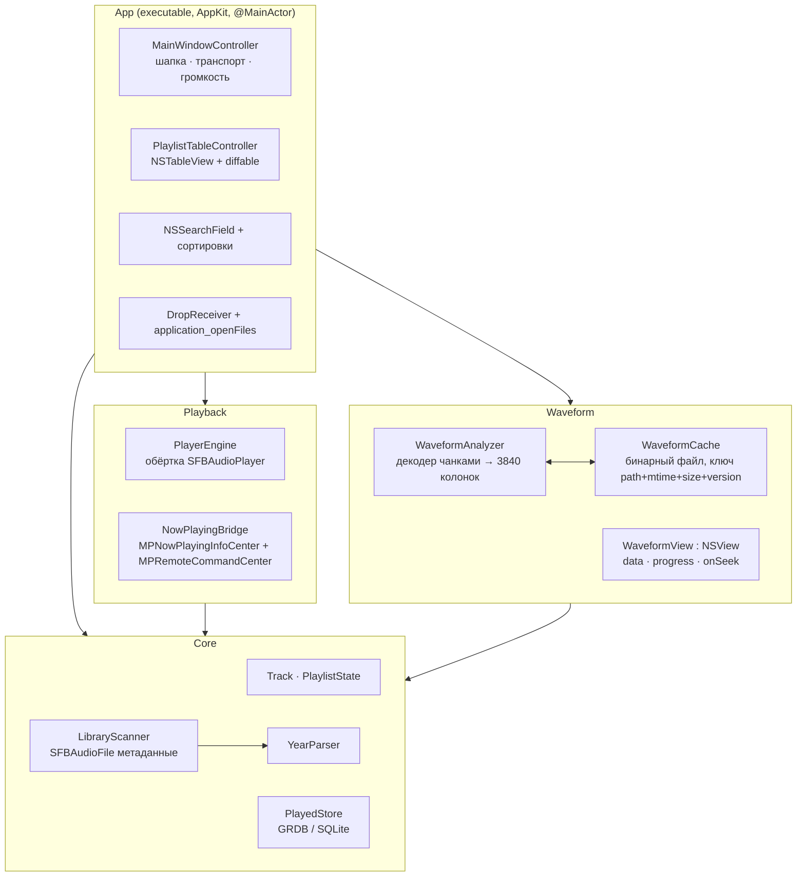
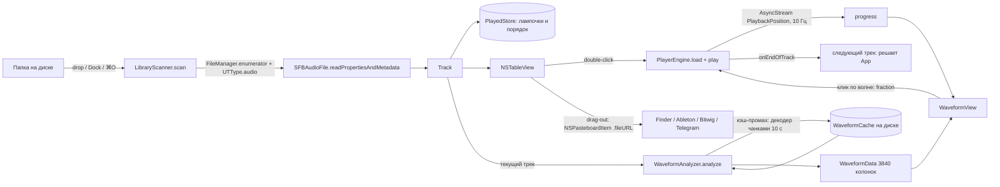

# SPEC: DJPlayer - нативный macOS-плеер для подготовки DJ-миксов

Дата: 2026-09-15 10:06. Автор: Fable (техлид). Основание: `research/INDEX.md` + `research/01..05`, `DECISIONS.md` (внутренний журнал решений владельца, в публичное дерево не входит).
Стенд проверок: macOS 27.0 (26A428), Apple Swift 6.3.3, target arm64-apple-macosx28.0.
Рабочее имя продукта и бинарника: `DJPlayer`.

---

## 1. Цель

Один плеер, в котором готовят DJ-микс: открыл папку с треками, увидел волну всего трека,
прослушал, отметил лампочкой отобранное, перетащил файл в DAW. Всё локально, всё быстро, ничего лишнего.

## 2. Что просят (v1)

| # | Требование | Источник |
|---|---|---|
| 1 | Вид как AIMP: шапка с обложкой и названием, транспорт, широкая волна всего трека, под ней плейлист | BRIEF, `research/aimp-reference.png` |
| 2 | Волна всего трека с прогрессом и перемоткой кликом | BRIEF, DECISIONS 09:55 |
| 3 | Плейлист колонками с заголовками: лампочка, номер, Название, Исполнитель, Год, Длительность | DECISIONS 09:55 |
| 4 | Сортировка кликом по заголовку (все колонки) + быстрый поиск по паре букв | DECISIONS 09:50 |
| 5 | Ручная лампочка «сыграно», живёт в SQLite по пути файла, помнится между запусками | DECISIONS 09:50, 09:55 |
| 6 | Drag-out строки наружу как файла из Finder (Ableton, Bitwig, Finder, Telegram) | DECISIONS 09:35 |
| 7 | Drop папки на окно и на иконку Dock - открывается как плейлист | BRIEF |
| 8 | Форматы MP3, FLAC, WAV, AIFF (плюс всё, что даёт SFBAudioEngine бесплатно) | DECISIONS 09:35 |
| 9 | Год из тега; пустой тег - пустая ячейка | DECISIONS 09:50 |
| 10 | Медиаклавиши и Now Playing | research/04 §4 |
| 11 | Плейлист (порядок + текущий трек) восстанавливается при запуске | Fable, следствие п.5 |
| 12 | Окно компактное, размером с одну панель терминала: 500×760 pt по умолчанию, минимум 420×600 | Владелец 10:09, `research/owner-size-reference.png` |

Цвет волны по частотам (RGB по Mixxx) - **не в v1**, отдельная волна W2b (DECISIONS 10:01).
В v1 волна одноцветная: сыгранное акцентом, несыгранное приглушённым, как на скриншоте AIMP.
Контракт `WaveformData` уже несёт три полосы (low/mid/high), чтобы W2b не меняла ни одного интерфейса.

## 3. Вне скоупа (явно, не делать)

- Эквалайзер, любой DSP, ReplayGain, кроссфейд, эффекты.
- Стриминг, радио, облако, Last.fm, MusicBrainz, обложки из сети.
- Фонотека/библиотека: база треков, папки-коллекции, смарт-плейлисты, слежение за папками.
- Редактирование тегов, запись чего-либо в аудиофайлы (в том числе POPM/рейтингов).
- Cue-точки, метки и сетка долей на волне, зацикливание. (BPM и тональность с 15.09 19:00 в скоупе: решение владельца, разбор через системный MusicUnderstanding.)
- Плагины, скрипты, темы, настройки цветов, Touch Bar, виджеты, Sparkle-обновления.
- Несколько плейлистов и вкладок, группировка со сворачиванием, очередь воспроизведения.
- Счётчик проигрываний и дата последнего проигрывания (лампочка ручная и одна).
- Сборка под Intel, sandbox, нотаризация, App Store, раздача кому-либо.
- Экспорт плейлиста в m3u8, импорт плейлистов, CUE.

---

## 4. Визуал

### 4.1 Раскладка окна

**Уточнение 2026-09-15 (после T12, по правкам владельца, заменяет цифры ниже):** шапка 164 pt (обложка-квадрат 140 у левого края, поля 12); справа от обложки название 17 pt bold / исполнитель 13 pt / техстрока 11 pt, под ними транспорт: иконки без подложек (зона клика 44, play 52), всё прижато к обложке; фейдер громкости channel strip (VOL / дорожка / проценты, 34 pt) прилеплен к правому краю; титлбар прозрачный, вместо заголовка логотип Claimp 18 pt слева. Колонки: Название ideal 150, Исполнитель ideal 120. Длинный текст гаснет в фон (§6.0). Всё лишнее пространство при растяжении остаётся между кластером слева и фейдером справа.


Пропорции по вертикали сняты со скриншота `research/aimp-reference.png` (874×1266 px), размер окна -
по `research/owner-size-reference.png` (уточнение владельца 2026-09-15 10:09).

**Окно компактное, размером с одну панель терминала** (красная рамка на скриншоте владельца - около 29 %
ширины и 66 % высоты экрана 13" MacBook Air): **по умолчанию 500×760 pt, минимум 420×600 pt**, тянется
мышью. Все высоты фиксированные, тянется только таблица. Двухстрочную строку трека из уточнения не берём:
она конфликтует с решением владельца от 09:55 («колонки с заголовками, одна строка на трек») - вместо неё
`Название` и `Исполнитель` отдельными узкими колонками.

```
┌──────────────────────────────────────────────────────┐
│ ● ● ●  DJPlayer                                      │ титлбар системный, тёмный, 28
├──────────────────────────────────────────────────────┤
│ ┌────────┐ Future Garage Mix Part 1                  │
│ │обложка │ Dj Antiz & Zebyte                         │ ШАПКА: 120
│ │ 96×96  │ MP3 · 44 kHz · 320 kbps · 2014            │ обложка 96×96, поля 12
│ └────────┘                                           │ текст: 15 / 12 / 11 pt, обрезка многоточием
├──────────────────────────────────────────────────────┤
│        ⏮    ⏹   ⟨ ▶ ⟩   ⏸    ⏭       🔊 ───●───     │ ТРАНСПОРТ: 44, кнопки 24, play 32 в кольце
│                                                      │ громкость справа: NSSlider 80 pt, поле 12
├──────────────────────────────────────────────────────┤
│▁▂▅█▇▆▃▂▁▂▄█▇▅▃▁▂▃▅▇█▆▄▂▁▂▃▄▅▆▇█▇▆▅▄▃▂▁▂▃▄▅▆▇█▇▆▅▄▃▂▁│ ВОЛНА: 80, во всю ширину, поля 0
│8:21                                            32:07 │ ВРЕМЯ: 14, 10 pt, моноширинные цифры
├──────────────────────────────────────────────────────┤
│● │ # │ Название        │ Исполнитель   │ Год │ Длит. │ ЗАГОЛОВКИ: 20, кликабельные, 10 pt
├──┼───┼─────────────────┼───────────────┼─────┼───────┤
│● │ 1 │ Future Garage…  │ Dj Antiz & Z… │2014 │ 32:07 │ СТРОКА: 13, одна строка на трек, 9 pt
│○ │ 2 │ Future Garage…  │ Dj Antiz & Z… │2014 │ 30:21 │
│○ │ 3 │ Future Garage…  │ Dj Antiz & Z… │     │ 30:41 │ год пустой = пустая ячейка
│● │ 4 │ Future Garage…  │ Dj Antiz & Z… │2015 │ 36:26 │
│  │   │                 │               │     │       │ ← таблица занимает всё лишнее (≈15 строк)
├──────────────────────────────────────────────────────┤
│               12 треков / 6:41:03                    │ СТАТУС: 20, по центру, 10 pt
├──────────────────────────────────────────────────────┤
│ 🔍 Поиск                                              │ ПОИСК: 30, NSSearchField во всю ширину, поля 8
└──────────────────────────────────────────────────────┘
```

Арифметика высот: 28 + 120 + 44 + 80 + 14 + 20 + 20 + 30 = 356 фиксированных, остальное (при 760 - около
404 pt, это ~15 строк) забирает таблица.

Колонки и стартовые ширины (pt, решение владельца 2026-09-15 17:57 - добавлены битрейт, BPM,
тональность): `●` 16, `#` 22 (правое), `Название` 130 (растёт), `Исполнитель` 100 (растёт),
`Год` 32 (правое), `Длит.` 44 (правое), `kbps` 52 (правое), `BPM` 48 (правое, без дробной части),
`Key` 44 (код Camelot, подсказка «8A · Am»). Решение владельца 2026-09-16: фиксированных колонок
нет, ширину любой колонки владелец тянет мышью в пределах `Theme.column.minAny`…`maxAny`
(у лампочки минимум - сама лампочка), не влезшее содержимое обрезается как в Название/Исполнитель,
строка при этом не расширяется. Ручные ширины помнит `autosaveName` таблицы; смена кегля
масштабирует их коэффициентом (`PlaylistFont.rescaled`), а не возвращает к токенам.
Лишнюю ширину окна делят между собой только Название и Исполнитель. Значение берётся по приоритету
(решение владельца 2026-09-15 17:57 и 19:00): тег (TBPM/TKEY, BPM/INITIALKEY, tmpo/©key), иначе
разбор через MusicUnderstanding, иначе пусто. Разбор идёт фоном после скана папки, по два трека
одновременно, темп приводится к диапазону 90-180, треки длиннее 15 минут пропускаются, результат
кэшируется в базе по пути, размеру и времени правки файла. Пока трек считается, в ячейке стоит
плейсхолдер «·»; ошибки разбора идут в stderr и счётчиком в статусную строку, остальные треки
считаются дальше; при выходе из приложения незавершённый разбор отменяется.
Решение владельца 2026-09-16: сам по себе разбор не запускается - настройка «Автоанализ»
по умолчанию выключена, пустые ячейки остаются пустыми. Анализ идёт по правому клику на
выделенных строках (одна, несколько, ⌘A - все): пункт «Проанализировать треки» считает ВСЕ
выделенные треки заново (`AnalysisRunner.analyze(urls:force:)`, кэш не читается, а
перезаписывается результатом); тег TBPM/TKEY в колонке по-прежнему главнее разбора. Включённый
«Автоанализ» работает как раньше: после скана считаются все треки без тега (`force: false`,
кэш подхватывается).
Текст в узких колонках обрезается многоточием по центру пути (`.byTruncatingTail`), не переносится.
Цифры в `#`, `Год`, `Длительность`, в подписях времени под волной и в статусной строке - `monospacedDigitSystemFont`.
Плотный плейлист (решение владельца 2026-09-15 17:57): строка 13 pt высотой, шрифт строки 9 pt,
заголовки колонок 8 pt, лампочка 6 pt - всё токенами Theme. Вторая строка описания трека
**не делается** (одна строка на трек, DECISIONS 09:55).

### 4.2 Цвета и волна (переписано по решению владельца 2026-09-15 12:23)

Старая палитра AIMP (оранжевый `#BD7A36`/`#D29046`, белый `#FFFFFF`, серый `#D8D8D8`) **отменена**:
владелец посмотрел живое окно и выбрал тёмный неоморфизм по эталону
`research/owner-ref-neumorphism-dark.png`, оранжевый и белый убраны везде.

**Токены темы** живут в `Sources/App/Theme.swift`, имена по роли, других цветов в `App` нет; значения
сняты пипеткой (PIL) с эталона:

| Токен | HEX | Роль |
|---|---|---|
| `background.base` | `#2B2F3A` | фон окна: шапка, транспорт, полоса волны, таблица, статус, поиск |
| `surface.raised` | `#343948` | выпуклая поверхность: кнопки транспорта, ручка громкости, лампочка |
| `surface.inset` | `#1E222B` | вдавленная: дорожка громкости, поле поиска, выделенная строка |
| `text.primary` | `#DCE0EA` | название, исполнитель, подписи кнопок |
| `text.secondary` | `#9AA1B3` | статус, время, заголовки колонок, второстепенные колонки |
| `accent.violet` | `#A888E0` | заполнение слайдера, текст выделенной строки, рамка дропа |
| `accent.pink` | `#D2A5AD` | зажжённая лампочка «сыграно» |
| `accent.gray` | `#6E7486` | декор: погашенная лампочка, деления; текстом не используется |
| `shadow.light` | `#3F4557` @ 0.40 | блик сверху-слева |
| `shadow.dark` | `#12151C` @ 0.55 | тень снизу-справа |
| `border.subtle` | `#232733` | разделители, шов под заголовками |

Геометрия темы там же: `shadow.offset` 3, `shadow.blur` 6; `radius` 6 / 12 / 18; `spacing` 4 / 8 / 12 / 16 / 24.
Вложенные скругления концентрические (`внешний = внутренний + отступ`).
Контраст измерен на `background.base` (WCAG): `text.primary` 10,12:1, `text.secondary` 5,17:1,
`accent.violet` 4,62:1, `accent.pink` 6,19:1, `accent.gray` 2,87:1 (декор, не текст).

Правила: тема только тёмная, `NSAppearance(named: .darkAqua)` на окне; поверхности рисуются слоями
CALayer (двойная тень для выпуклых, внутренняя тень для вдавленных), картинок и ассетов нет;
выделение строки - вдавленная поверхность с текстом `accent.violet`, системное синее выключено
(`NSTableRowView.drawSelection(in:)`, приём Aural,
`aural-player/Source/UI/Playlist/AuralPlaylistViews.swift:15-27`).
Задача - T12 (тема неоморфизма).

**Волна** (задача T11) - обзорная волна как у Serato
(`research/owner-ref-serato-waveform.png`, средняя полоса), а не сплошная полоса: колонка это
**RMS**, а не пик; три полосы нормируются **одним общим пиком**; при отрисовке - энергетическое
среднее по пикселю, сглаживание соседних пикселей и мягкая компрессия, поэтому видно всплески и ямы.
Столбик симметричен от центральной оси, высота = амплитуда, цвет = смесь полос по формуле Mixxx
(`waveformrendererrgb.cpp:159-182`: взвешенная сумма цветов полос, делённая на максимальную
компоненту, поэтому цвет всегда яркий, а громкость несёт только высота). **Высота и цвет считаются
по разным шкалам:** высота - общий RMS трека (как в кэше), цвет - каждая полоса по своему пику,
иначе общий пик давит верх (у мастеринга он тише баса на 15-20 дБ) и синего на волне не видно.
Прогресс показывается **яркостью**: несыгранное 45 %, сыгранное 100 %, курсор - линия 1 pt.
Палитра и параметры волны - в `public struct WaveformStyle` (модуль `Waveform`), литералов в
отрисовке нет: басы `#FF0000`, середина `#00FF00`, верхи `#0000FF` - чистые компоненты R/G/B
(решение владельца 13:5x), смесь даёт жёлтый (бас + середина), бирюзовый (середина + верх),
розово-маджентовый (бас + верх) и белый на всём спектре; фон `#2B2F3A`, курсор `#DCE0EA`,
компрессия `.power(0.5)`, радиус сглаживания 2. Контраст на фоне: басы 3,34:1, середина 9,82:1,
смеси от 4,3 до 20:1 (WCAG), у чистого синего низкий по природе - он и в эталоне глубокий.
Решением владельца 2026-09-15 13:33 палитра волны спектральная и яркая
(`research/owner-ref-serato-waveform.png`), приглушённая палитра остаётся только у интерфейса;
форма - аккуратная огибающая с воздухом, доводка визуала - отдельная задача Opus.
`WaveformData.formatVersion` = 3 (смысл колонок сменился с пика на RMS, старые кэши не годятся).

### 4.4 Настройки (⌘,) - решение владельца 2026-09-15 19:49

Окно настроек открывается по ⌘, и пункту меню «Claimp → Настройки…». Вкладок нет: одна колонка
групп в плоском стиле темы (все цвета, кегли и размеры - токены `Theme`; галочки и заполнение
дорожек покрашены в `accent.violet`, системный синий не используется).

| Группа | Настройка | Значения | По умолчанию |
|---|---|---|---|
| Плейлист | Видимые колонки | чекбокс на каждую колонку, кроме лампочки «сыграно» | все видны |
| Плейлист | Размер шрифта | 8-16 pt | 11 pt (на 20 % больше прежних 9) |
| Анализ | Автоанализ | вкл/выкл | выкл (решение владельца 2026-09-16) |
| Анализ | Диапазон BPM | 70-140 / 85-170 / 90-180 | 90-180 |
| Анализ | Не считать длиннее | 1-60 мин | 15 мин |
| Анализ | Формат тональности | Camelot (8A) / нота (Am) / оба | Camelot |
| Волна | Палитра | спектр / одноцветная | спектр |
| Волна | Яркость несыгранного | 10-100 % | 45 % (дефолт `WaveformStyle`) |
| Общее | Сбросить настройки | кнопка | - |

Правила:
- Хранение - только `UserDefaults`, ключи с префиксом `Claimp.` (`SettingsKey`); файлов настройки
  не создают. Негодное значение в хранилище (кегль 99, незнакомый пресет) приводится к
  допустимому при чтении, а не роняет окно.
- Все настройки применяются на лету, без перезапуска: `SettingsStore` рассылает нотификацию,
  подписчики (плейлист, волна, очередь анализа) применяют значение.
- Межстрочное расстояние плейлиста остаётся плотным: высота строки = высота глифов выбранного
  кегля, вверх до целого пункта (`PlaylistFont.rowHeight`). При дефолтных 11 pt это те же 13 pt,
  что были у 9 pt. Фиксированные колонки (номер, год, длительность, kbps, BPM, Key)
  масштабируются тем же коэффициентом, иначе на крупном кегле цифры обрезаются; после пересчёта
  таблица раздаёт ширину заново (`sizeToFit`), чтобы текстовые колонки ужались раньше, чем
  крайняя уедет за край окна.
- Отладочный ключ запуска `--open-settings` (и `CLAIMP_OPEN_SETTINGS=1`) открывает окно настроек
  сразу после старта: он нужен для снимков и проверок без клавиатуры.

### 4.3 Модули и потоки данных



Направление зависимостей жёсткое: `App → Playback | Waveform | Core`, `Playback → Core`, `Waveform → Core`,
`Core` не зависит ни от кого из своих. Циклов импортов - ноль, проверяется гейтом.



---

## 5. Контракты между модулями

Это то, что параллельные исполнители W1 обязаны реализовать буква в букву: чужие модули они не видят,
сходятся только по этим сигнатурам. Менять сигнатуру можно только через Fable, не самостоятельно.

### 5.1 Core

```swift
// Sources/Core/Track.swift
public struct Track: Sendable, Equatable, Identifiable {
    public var id: URL { url }
    public let url: URL              // путь к файлу = ключ во всей системе
    public let title: String         // из тега; пусто в теге - имя файла без расширения
    public let artist: String        // из тега; пусто в теге - "" (пустая ячейка)
    public let album: String
    public let year: Int?            // nil = пустая ячейка, не 0 и не "-"
    public let duration: TimeInterval
    public let bitrate: Int?         // kbps, округлённый
    public let sampleRate: Int?      // Hz
    public let format: String        // "MP3", "FLAC", "WAV", "AIFF" - из SFBAudioProperties.formatName
    public let artwork: Data?        // байты обложки как лежат в теге; nil = обложки нет
    public var isPlayed: Bool        // ручная лампочка, приезжает из PlayedStore

    public init(url: URL, title: String, artist: String, album: String, year: Int?,
                duration: TimeInterval, bitrate: Int?, sampleRate: Int?, format: String,
                artwork: Data?, isPlayed: Bool)

    public var displayYear: String   // "" если year == nil
    public var displayDuration: String   // "32:07", "1:12:45" при часе и больше
    public var headerSubtitle: String    // "MP3 · 44 kHz · 320 kbps · 2014", пустые части пропускаются
}

// Sources/Core/YearParser.swift - чистая функция, отдельно ради PBT
public enum YearParser {
    /// Год из произвольной строки даты тега: "1994", "1994-03-15", "15/03/1994", "1994.03".
    /// Берётся первое вхождение 19xx/20xx. Мусор и nil дают nil.
    public static func year(from raw: String?) -> Int?
}

// Sources/Core/TrackListLogic.swift
// Всё, что можно проверить тестом без окна, живёт в Core: у App нет тест-таргета
// (структура пакета фиксирована), поэтому фильтр, сортировка и текст статусной строки - здесь.
public enum TrackFilter {
    /// Подстрока без учёта регистра и диакритики по title и artist (localizedStandardContains).
    /// Пустой или пробельный запрос возвращает вход как есть. Порядок всегда сохраняется.
    public static func filter(_ tracks: [Track], query: String) -> [Track]
}
public enum TrackSortField: String, Sendable, CaseIterable {
    case played, number, title, artist, year, duration
}
public enum TrackSort {
    /// Стабильная сортировка. year == nil всегда в конце, в обе стороны.
    public static func sorted(_ tracks: [Track], by field: TrackSortField, ascending: Bool) -> [Track]
}
public enum PlaylistSummary {
    /// "12 треков / 6:41:03"; пустой список - "0 треков / 0:00".
    public static func text(for tracks: [Track]) -> String
}
public enum PlaylistNavigator {
    /// Следующий/предыдущий по текущему видимому порядку строк. Последний трек даёт nil
    /// (зацикливания нет), неизвестный url даёт первый/последний. Добавляется задачей T5.
    public static func next(after url: URL?, in urls: [URL]) -> URL?
    public static func previous(before url: URL?, in urls: [URL]) -> URL?
}

// Sources/Core/LibraryScanner.swift
public protocol LibraryScanning: Sendable {
    /// Рекурсивный обход папки, только аудио по UTType.audio, сортировка по имени файла
    /// (localizedStandardCompare). Нечитаемые файлы пропускаются молча, не роняют скан.
    func scan(folder: URL) async -> [Track]
    /// Тот же маппинг для одного файла; nil, если файл не аудио или не читается.
    func track(at url: URL) async -> Track?
}
public struct LibraryScanner: LibraryScanning, Sendable {
    public init()
}

// Sources/Core/PlayedStore.swift
public protocol PlayedStoring: Sendable {
    func isPlayed(_ url: URL) throws -> Bool
    func setPlayed(_ url: URL, _ value: Bool) throws
    func playedURLs(among urls: [URL]) throws -> Set<URL>     // один запрос на весь плейлист
    func savePlaylist(_ urls: [URL], current: URL?) throws
    func loadPlaylist() throws -> PlaylistState
}
public struct PlaylistState: Sendable, Equatable {
    public let urls: [URL]
    public let current: URL?
    public static let empty: PlaylistState
}
public final class PlayedStore: PlayedStoring {
    /// Боевой путь: ~/Library/Application Support/DJPlayer/player.sqlite (создаётся при первом запуске).
    public static func makeDefault() throws -> PlayedStore
    /// Для тестов: любой путь, в т.ч. временная папка.
    public init(path: URL) throws
}
```

Схема GRDB (одна миграция `v1`, `DatabaseQueue`, WAL):

```sql
CREATE TABLE played (
    path       TEXT    PRIMARY KEY,
    played     INTEGER NOT NULL DEFAULT 0,
    updated_at DOUBLE  NOT NULL
);
CREATE TABLE playlist (
    position INTEGER PRIMARY KEY,
    path     TEXT NOT NULL
);
CREATE TABLE app_state (
    key   TEXT PRIMARY KEY,
    value TEXT NOT NULL      -- current_path
);
```

`savePlaylist` пишет обе таблицы в одной транзакции (`DELETE FROM playlist` + вставка).
Ключ лампочки - `url.path` (решение владельца: «хранится у файла по пути»). Переезд файла теряет лампочку,
это принято.

### 5.2 Playback

```swift
// Sources/Playback/PlaybackTypes.swift
public struct PlaybackPosition: Sendable, Equatable {
    public let current: TimeInterval
    public let total: TimeInterval
    public var fraction: Double      // 0…1, при total <= 0 возвращает 0
}
public enum PlaybackState: Sendable, Equatable { case idle, playing, paused }

// Sources/Playback/PlayerEngine.swift
@MainActor
public protocol PlayerEngineProtocol: AnyObject {
    var state: PlaybackState { get }
    var currentURL: URL? { get }
    var volume: Float { get set }                       // 0…1, клампится
    /// Тик позиции 10 Гц, пока идёт воспроизведение. Один поток на весь срок жизни движка.
    var positions: AsyncStream<PlaybackPosition> { get }
    /// Трек доиграл до конца. Следующий выбирает App, не движок.
    var onEndOfTrack: (@MainActor () -> Void)? { get set }
    func load(_ url: URL) throws        // готовит трек, не играет
    func play() throws
    func pause()
    func stop()
    func seek(fraction: Double)         // вне 0…1 клампится, без ошибки
}
@MainActor
public final class PlayerEngine: PlayerEngineProtocol {
    public init()
}
public enum PlayerEngineError: Error, Equatable { case cannotOpen(URL), notLoaded }

// Sources/Playback/NowPlayingBridge.swift
@MainActor
public final class NowPlayingBridge {
    public init()
    public var onPlay: (@MainActor () -> Void)?
    public var onPause: (@MainActor () -> Void)?
    public var onToggle: (@MainActor () -> Void)?
    public var onNext: (@MainActor () -> Void)?
    public var onPrevious: (@MainActor () -> Void)?
    public func register()                                    // идемпотентно
    public func update(title: String, artist: String, album: String,
                       duration: TimeInterval, elapsed: TimeInterval,
                       rate: Double, artwork: Data?)
    public func clear()
}
```

### 5.3 Waveform

```swift
// Sources/Waveform/WaveformData.swift
public struct WaveformData: Sendable, Equatable {
    public static let columnCount = 3840          // как у Mixxx: 2 * 1920 на трек, независимо от длины
    public static let formatVersion: UInt32 = 3   // 3: колонка - RMS полосы (T11), 2: пик полосы, 1: общий пик

    public struct Column: Sendable, Equatable {
        public let low: Float                     // 0…1, RMS полосы (600 Гц / 4 кГц), общая нормировка
        public let mid: Float
        public let high: Float
        public var peak: Float { max(low, max(mid, high)) }
        public init(low: Float, mid: Float, high: Float)
    }
    public let columns: [Column]                  // ровно columnCount элементов
    public init(columns: [Column])
    public func column(atProgress progress: Double) -> Column?   // прогресс вне 0…1 клампится
    // Бинарный кодек кэша: "DJWF" + version(UInt32 LE) + count(UInt32 LE) + count*3*Float32 LE
    public func encoded() -> Data
    public static func decoded(from data: Data) throws -> WaveformData
}
public enum WaveformError: Error, Equatable {
    case cannotOpen(URL), cannotRead(URL, Int), cancelled, badCache
}

// Sources/Waveform/WaveformAnalyzer.swift
public protocol WaveformAnalyzing: Sendable {
    /// Считает волну (или отдаёт из кэша). Тяжёлая работа вне главного потока, память константная.
    func analyze(url: URL) async throws -> WaveformData
}
public struct WaveformAnalyzer: WaveformAnalyzing, Sendable {
    public init(cache: WaveformCache = .default)
}

// Sources/Waveform/WaveformStyle.swift
public struct WaveformStyle: Sendable, Equatable {
    /// Цвет в sRGB, компоненты 0…1: свой тип, чтобы модуль не тянул AppKit в расчёты.
    public struct Color: Sendable, Equatable {
        public init(red: Double, green: Double, blue: Double)
        public init(hex: UInt32)                       // #RRGGBB
    }
    /// Мягкая компрессия амплитуды: без неё отлимитированный мастер даёт прямоугольник.
    public enum Compression: Sendable, Equatable {
        case linear, power(Double), logarithmic(floorDb: Double)
        public func apply(_ value: Float) -> Float      // вход и выход 0…1
    }
    // Цвета: low/mid/high (спектральная палитра Serato), background, cursor;
    // параметры: compression, smoothingRadius, unplayedBrightness/playedBrightness,
    // cursorWidth, verticalInset, minimumBarHeight. Литералов в отрисовке нет.
    public static let `default`: WaveformStyle
    /// Цвет столбика: взвешенная сумма цветов полос по формуле Mixxx, делённая на максимальную
    /// компоненту (цвет всегда яркий, громкость несёт высота).
    public func mix(low: Float, mid: Float, high: Float) -> Color
}

// Sources/Waveform/WaveformCache.swift
public struct WaveformCache: Sendable {
    /// ~/Library/Caches/dev.shima.djplayer/waveform/
    public static let `default`: WaveformCache
    public init(directory: URL)
    /// Ключ: путь + mtime + размер файла + formatVersion (схема WaveformKit/WaveformCache.swift:26-33).
    public func load(for url: URL) -> WaveformData?
    public func store(_ data: WaveformData, for url: URL)
}

// Sources/Waveform/WaveformView.swift
@MainActor
public final class WaveformView: NSView {
    public var data: WaveformData?          // nil = ровный фон: сигнала нет, линию рисовать нечем
    public var progress: Double             // 0…1, клампится; меняет только яркость и курсор
    public var style: WaveformStyle         // вместо Palette: цвета, компрессия, яркости, курсор
    public var onSeek: ((Double) -> Void)?  // клик и горизонтальный драг по волне
}
```

### 5.4 Границы Sendable / акторов

- `Core`: все типы - `Sendable`-значения. `PlayedStore` - `final class`, внутри `DatabaseQueue`
  (сам потокобезопасен и `Sendable` в GRDB 7), методы синхронные и бросают; вызываются из `@MainActor`
  без хопов, длинных запросов нет.
- `LibraryScanner.scan` - `async`, внутри `Task.detached(priority: .userInitiated)`. Объекты
  `SFBAudioFile` / `AudioMetadata` не `Sendable` и **не пересекают границу задачи**: они создаются,
  разбираются в `Track` и умирают внутри одной задачи.
- `Playback`: `PlayerEngine` целиком `@MainActor` (`MPRemoteCommandCenter.shared()` - main-thread
  singleton, `bocan-music/.../RemoteCommands.swift:9-10`). Делегат `SFBAudioPlayer` приходит с чужого
  потока: внутренний `nonisolated final class DelegateBox: NSObject, AudioPlayer.Delegate`, каждый
  колбэк делает `Task { @MainActor in ... }`. Тик позиции - `Timer` 10 Гц на главном потоке,
  пишет в `AsyncStream.Continuation`.
- `Waveform`: `analyze` считает в `Task.detached(priority: .utility)`; наружу отдаёт только
  `WaveformData` (значение, `Sendable`). `WaveformView` - `@MainActor`, ничего не считает.
- `App`: всё `@MainActor`, никаких своих очередей и семафоров.
- `@preconcurrency import` разрешён только для `SFBAudioEngine` и `MediaPlayer`, и только если без него
  не собирается; каждое использование - с комментарием почему.

---

## 6. Поведение

**6.0b Drag-out из двух мест (решение владельца 2026-09-15, уточнено в 15:4x):** текущий трек можно схватить и перетащить как файл в DAW/Finder из строки плейлиста и за обложку в шапке. С волны drag отменён: волна = только перемотка/скраб. Pasteboard: `.fileURL` (тот же рецепт Bòcan), операция `.copy`, drag-image = обложка/строка. На волне клик остаётся перемоткой: drag файла стартует после порога смещения (NSDraggingSession через `beginDraggingSession` из `mouseDragged` при |dx|+|dy| > 6 pt), пока порог не пройден - это seek-скраб.

**6.0 Длинный текст (решение владельца 2026-09-15):** название, исполнитель, техстрока и ячейки таблицы никогда не расширяют окно, шапку и колонки. Не влезает - текст обрезается мягко: правый край уходит в градиент цвета фона (fade), без многоточия и переноса. Реализация: маска CAGradientLayer или NSTextField в контейнере с clipsToBounds и градиентной накладкой, `setContentCompressionResistancePriority(.defaultLow, for: .horizontal)` у текста.


1. **Drop папки на окно.** `registerForDraggedTypes([.fileURL])` на корневой вью
   (`aural-player/Source/UI/Player/DragDroppablePlayerView.swift:18`), чтение
   `readObjects(forClasses: [NSURL.self])`. Папка обходится рекурсивно `FileManager.enumerator`,
   берутся файлы с `UTType` наследником `.audio`, порядок - по имени файла `localizedStandardCompare`.
   Дроп заменяет плейлист целиком. Дроп отдельных файлов работает так же. Подсветка цели - рамка
   акцентом на время драга.
2. **Dock и «Открыть с помощью».** `application(_:openFiles:)`
   (`bocan-music/App/BocanApp.swift:113-120`), `CFBundleDocumentTypes` с `public.folder` и `public.audio`
   уже в `scripts/build-app.sh`. Реализуется ровно один из `openFiles`/`open` - иначе AppKit вызовет
   не тот.
3. **Double-click по строке** - грузит и играет трек. Enter на выделенной строке - то же самое.
   Пробел - play/pause.
4. **Конец трека** (`audioPlayerEndOfAudio`) - играет следующий по текущему порядку строк в таблице
   (порядок после сортировки и с учётом фильтра поиска); последний трек - стоп, курсор в конце.
   Лампочка автоматически **не ставится** (DECISIONS 09:35: ставит только человек).
5. **Drag-out строки наружу** - `tableView(_:pasteboardWriterForRow:)`, один `NSPasteboardItem` на строку:
   `setString(String(row), forType: .string)` для внутреннего переупорядочивания и
   `setString(url.absoluteString, forType: .fileURL)` для внешнего приёмника
   (`bocan-music/Modules/UI/Sources/UI/Browse/TrackTableHelpers.swift:230-245`), плюс
   `tableView.setDraggingSourceOperationMask(.copy, forLocal: false)` (`TrackTable.swift:134`).
   Мультивыделение уезжает несколькими файлами. Промисы (`NSFilePromiseProvider`) не используются:
   файл уже есть на диске.
6. **Drag внутри таблицы** меняет порядок строк; ручной порядок сбрасывается при клике по заголовку
   (сортировка) и сохраняется в базу после каждой перестановки.
7. **Delete / Backspace** - удаляет выделенные строки из плейлиста. Файлы на диске не трогаются, никогда.
8. **Поиск** - подстрока без учёта регистра и диакритики (`localizedStandardContains`) по `title`
   и `artist`. Пустой запрос = весь плейлист. Поиск фильтрует отображение, плейлист в базе не меняет.
9. **Клик по заголовку колонки** - сортировка по этой колонке, повторный клик - обратный порядок,
   стрелка в заголовке. Сортируются все шесть колонок; `Год` с `nil` уезжает в конец в обе стороны.
   Сортировка выполняется по массиву моделей, не в SQL.
10. **Лампочка** - клик по кружку в первой колонке переключает флаг, пишет в SQLite сразу
    (`setPlayed`), строка не выделяется по этому клику. Состояние переживает перезапуск.
11. **Плейлист восстанавливается при запуске**: `loadPlaylist()` даёт порядок и текущий трек,
    файлы, которых больше нет на диске, выбрасываются молча. Метаданные перечитываются сканером
    (не кэшируются в базе - фонотеки у нас нет).
12. **Волна**: при загрузке трека `analyze(url:)`; пока считается - полоса пустая с тонкой линией по
    центру, без спиннера. Клик или горизонтальный драг по волне = `seek(fraction:)`. Курсор двигается
    по `positions`.
13. **Громкость** - компактный слайдер справа в ряду транспорта, 0…1, сохраняется в `UserDefaults`,
    применяется при старте. Размер и положение окна сохраняются `setFrameAutosaveName("DJPlayerMain")`.
14. **Медиаклавиши** F7/F8/F9 и Now Playing - через `NowPlayingBridge`; next/prev вызывают те же
    действия App, что и кнопки транспорта.
15. **Обложка** - из тега текущего трека; нет обложки - пустой прямоугольник фона `#282828` без
    иконки-заглушки.
16. **Random** (решение владельца 2026-09-16) - кнопка `shuffle` в транспорте справа от «следующий»:
    включена (иконка акцентом) - следующий трек выбирается случайно из видимых строк и никогда не
    совпадает с текущим (`PlaylistNavigator.random`), это работает и для кнопки «следующий», и для
    медиаклавиши, и для автоперехода в конце трека; «предыдущий» всегда по порядку. Режим хранится
    в настройках (`Claimp.playback.shuffle`, по умолчанию выключен) и переживает перезапуск,
    в окне настроек не показывается.
17. **Ошибки** - fail fast: не открылся файл при воспроизведении - алерт с путём и причиной,
    трек остаётся выделенным, автопереход не запускается. Молча глотать нельзя ничего.

---

## 7. Планка

Обязательный блок, действует на все задачи W1-W3.

### 7.1 PBT там, где есть инварианты

Инструмент: **swift-testing + `x-sheep/swift-property-based` (PropertyBased, MIT, v2.0.0)**.
Проверено на этой машине 2026-09-15 10:03: `swift build`/`swift test` с `propertyCheck(input: Gen.int(in:))`
проходят на Swift 6.3.3 (проба `pbtcheck`, сборка 12.35 s, тест зелёный). Есть трейт
`.fixedSeed(...)` для воспроизведения падения и шринкер. Зависимость **только у тест-таргетов**,
в продуктовый бинарь не попадает. Если пакет сломается на обновлении тулчейна - падаем на свои
генераторы поверх `SeededRandomNumberGenerator`, тесты остаются те же по смыслу.

Три обязательных свойства (по одному на шов, где есть инвариант):

| # | Что | Свойства | Где |
|---|---|---|---|
| 1 | `YearParser.year(from:)` | (а) для строки, содержащей год 1900…2099 в любом из форматов тега (`"1994"`, `"1994-03-15"`, `"15/03/1994"`, `"1994.03"`), возвращается именно этот год; (б) на произвольном мусоре (любая строка до 64 символов) функция не падает и не возвращает год вне 1900…2099 | CoreTests |
| 2 | Кодек кэша волны | (а) roundtrip: `decoded(from: data.encoded()) == data` для случайных колонок; (б) обрезанный или испорченный буфер даёт `WaveformError.badCache`, а не крэш и не мусорные данные | WaveformTests |
| 3 | Фильтр поиска | (а) пустой запрос - тождество; (б) результат - подпоследовательность входа (порядок сохранён, дублей нет); (в) регистр не влияет: `filter(q) == filter(q.uppercased())` | CoreTests (фильтр живёт в Core, чтобы его можно было тестировать без UI) |

Не применяем PBT к маппингу тегов, к GRDB-обёртке, к AppKit-вьюхам - там поведенческие тесты.
Seed печатается тест-раннером при падении, воспроизводится трейтом `.fixedSeed`.

### 7.2 CRAP и покрытие

- Цикломатическая сложность каждой новой и изменённой функции ≤ 10.
- Покрытие изменённых строк ≥ 80 % (`swift test --enable-code-coverage`, отчёт через `llvm-cov export`
  по объединённому профилю, не по отдельным прогонам).
- Ни одной функции с CRAP > 30; среднее по репо держать < 5.
- Замер один раз на гейте (T9); отчёт гейта — во внутреннем рабочем каталоге, в публичное дерево не входит.

### 7.3 Зависимости

- Новых циклов импортов - 0. Проверка: `swift package show-dependencies` + грепом по `import` внутри
  `Sources/` (`Core` не имеет права импортировать `Playback`, `Waveform`, `App`).
- Новых прямых зависимостей пакета сверх трёх (`SFBAudioEngine`, `GRDB.swift`, `PropertyBased` в тестах) - 0.
  Любая четвёртая - через Fable, с причиной.
- `Package.swift` правит только скелетчик (T0). Исполнители W1 его не трогают - иначе три конфликта на пустом месте.

### 7.4 Тесты

- Поведенческие, не текстовые: `toContain`-проверок исходников и конфигов нет вообще.
- На каждый шов 1 happy + 1 failure. Матриц и e2e-фреймворков нет.
- Тест-таргеты ровно три: `CoreTests`, `PlaybackTests`, `WaveformTests` (структура пакета
  зафиксирована). У `App` тестов нет по построению: вся логика, которую можно проверить без окна
  (фильтр, сортировка, статусная строка, форматирование времени и года), вынесена в `Core` и покрыта
  там; в `App` остаётся только раскладка и связывание AppKit-объектов, оно проверяется живым смоком
  (`§8`) и слепым QA.
- Живые файлы для тестов генерируются в `Tests/.../Fixtures` скриптом или берутся из рабочих файлов ресёрча
  (в публичное дерево не входят; там уже лежат `id3v23.mp3`, `id3v24.mp3`, `tagged.flac`, `tagged.m4a`, `tone.wav`, `tone.aiff`
  с контролируемыми тегами: TYER/TDRC/DATE/©day = 1994). Свои корпуса на тысячи файлов не плодить.
- Тест длиннее реализации - перебор, сокращать.

### 7.5 Мутация

Одна на всю волну, только на гейте (T9), только на границе потребителя, выбирает критик (не билдер).
Кандидаты границ: запись `setPlayed` в SQLite; запись/чтение плейлиста в `savePlaylist`;
запись колонок в кэш волны; кламп в `seek(fraction:)`. Строку drag-out
`item.setString(url.absoluteString, forType: .fileURL)` мутантом **не брать**: тестами она не
прикрыта по построению (у App нет тест-таргета), мутант там заведомо зелёный и ничего не доказывает -
эта строка проверяется живым перетаскиванием в Finder (п.8 §8).
Зелёный мутант - это не автоматически дефект: сначала дифференциальная проба, статусы «эквивалентный код»
и «мёртвый код» разрешены и означают удаление кода, а не новый тест. Откат мутации - копией файла с
проверкой пустого `git diff --stat`; `git checkout --` и `stash` запрещены.

### 7.6 Скоуп

- Что просят: раздел 2. Вне скоупа: раздел 3. Критерий «готово»: раздел 8.
- Тронутые тесты для прогона: `swift test` целиком (три тест-таргета, весь прогон - секунды,
  дробить нечего).
- Исполнитель, вышедший за периметр файлов своей задачи, сдаёт задачу заново; проверка -
  `git diff --stat` на гейте.

---

## 8. Критерий «готово» для v1 (живой смок)

Пятнадцать проверяемых пунктов. Все - на собранном `build/DJPlayer.app`, запущенном из Finder,
на настоящей папке с миксами, а не на тестовых файлах. Скриншоты и тайминги — во внутреннем
рабочем каталоге, в публичное дерево не входят.

1. `bash scripts/build-app.sh` собирает без ошибок и предупреждений Swift 6, `build/DJPlayer.app`
   запускается двойным кликом из Finder, окно открывается в тёмной теме компактным (около 500×760 pt,
   рядом с панелью терминала выглядит как на `research/owner-size-reference.png`), тянется до 420×600
   без наложения элементов и запоминает размер между запусками.
2. Перетаскивание папки с ≥ 50 файлами (MP3 и FLAC вперемешку) на окно: плейлист заполняется
   за < 2 с, порядок - по имени файла, колонки заполнены, пустой год в теге даёт пустую ячейку,
   ни одной строки с «1503» или «0».
3. Перетаскивание той же папки на иконку в Dock даёт тот же результат.
4. Double-click играет трек; шапка показывает обложку, название, исполнителя и строку
   «MP3 · 44 kHz · 320 kbps · 2014»; звук идёт.
5. Волна 60-минутного MP3 появляется цветной полосой за **< 3 с** после старта трека (первый прогон,
   холодный кэш); повторное открытие того же трека рисует волну **мгновенно** (< 100 мс, из кэша).
   Время замерено и записано.
6. Клик в середину волны перематывает туда: звук и курсор сходятся, время слева совпадает с позицией.
7. Курсор на волне движется без рывков, сыгранная часть закрашивается акцентом.
8. Перетаскивание строки в Finder создаёт **копию файла** в папке назначения (файл открывается и играет);
   перетаскивание в Ableton Live и в Bitwig кладёт трек на дорожку; перетаскивание в Telegram Desktop
   прикрепляет файл. Мультивыделение из трёх строк даёт три файла.
9. Клик по заголовку «Длительность» сортирует по возрастанию, повторный - по убыванию; то же для
   «Год», «Название», «Исполнитель»; треки без года уезжают в конец.
10. Ввод двух букв в поиск фильтрует список по названию и исполнителю; очистка возвращает весь список
    в прежнем порядке.
11. Клик по лампочке зажигает её; после `⌘Q` и повторного запуска лампочки, порядок плейлиста и
    текущий трек - те же.
12. Конец трека переключает на следующий без паузы и без щелчка; на последнем треке воспроизведение
    останавливается.
13. Медиаклавиши F8 (play/pause), F7/F9 (prev/next) работают, когда окно неактивно; в Пункте управления
    видны название, исполнитель и обложка текущего трека.
14. Delete удаляет выделенные строки из списка, файлы на диске остаются на месте (проверено в Finder).
15. Память процесса после прогона десяти 60-минутных треков подряд - меньше 400 МБ
    (`Activity Monitor`), нет роста после каждого трека; CPU в простое при паузе - около нуля.

---

## 9. Открытые вопросы владельцу

Только то, чего нет в `DECISIONS.md`, `OPEN-QUESTIONS.md` и отчётах. Ни один не блокирует W1.

1. **Название приложения и где живёт репозиторий.** Сейчас рабочее имя `DJPlayer`, черновик лежит в
   `~/dev/tries/2026-09-15-dj-player` без remote. Оставляем черновиком или заводим нормальный репозиторий
   (и под каким именем)?
2. **Считать ли волны заранее для всего плейлиста фоном** (открыл папку - через минуту все волны готовы,
   диск и CPU заняты), или как сейчас в плане: волна считается только для того трека, который включили?
3. **Нужна ли кнопка «погасить все лампочки»** (и «удалить отмеченные из списка») или лампочки гасятся
   только по одной руками?
